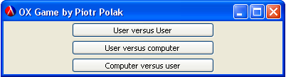
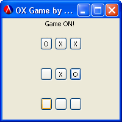

Tic tac toe
===========

Tic tac toe game implementation in Scheme using Minmax algorithm.

Written in 2008 as a homework for "Functional Programming" lab.

Screens
----------------

More information
----------------
* http://en.wikipedia.org/wiki/Tic-tac-toe
* http://en.wikipedia.org/wiki/Scheme_(programming_language)
* http://en.wikipedia.org/wiki/Minmax